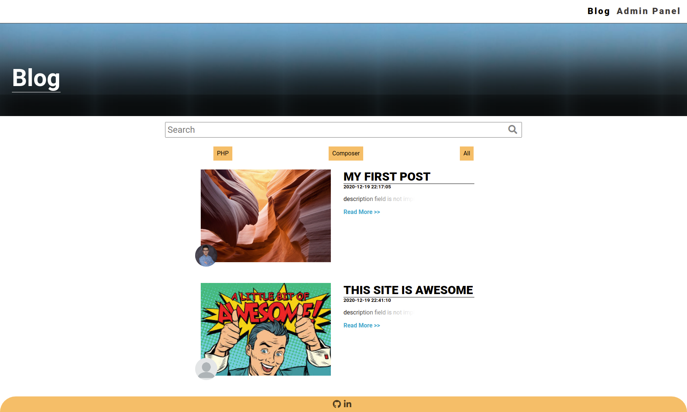
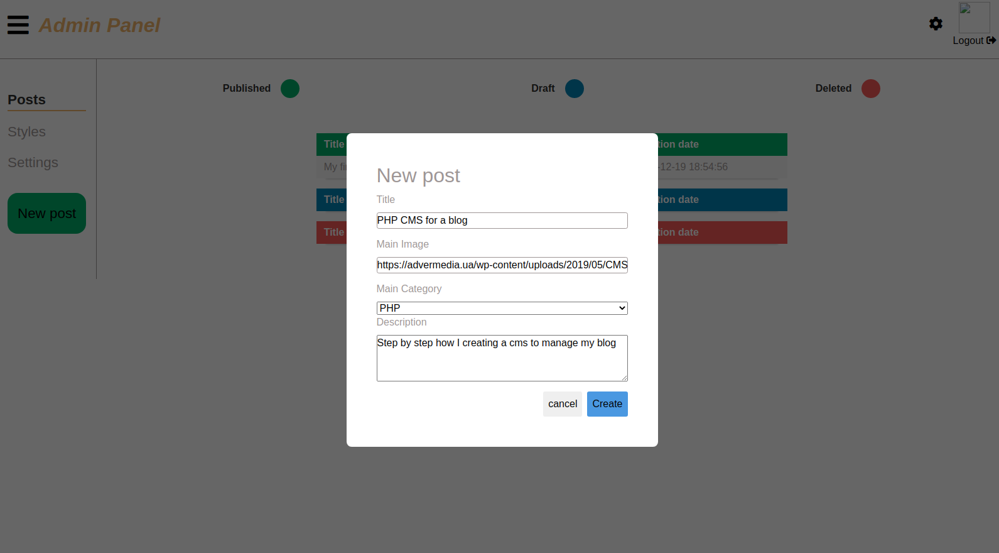

[![LinkedIn][linkedin-shield]][linkedin-url]


<!-- PROJECT LOGO -->
<br />
<p align="center">


  <h1 align="center">CMS FOR A BLOG </h1>
  <p align='center'>
  <a href='https://tonijorda.com/myProjects/PHP/blogCMS/blog.php'>View Demo</a>
  </p>
</p>


<!-- ABOUT THE PROJECT -->
## About The Project
Control management system for a blog. It allows to create, edit, publish and withdraw posts. This is the continuation of a previous project that can be found
    <a href="https://github.com/Skebard/simple-CMS-for-blog">here.</a>
This version does present the following new features:
- Login (with csrf token)
- More options for the post editor


The major changes are in the code structure. For this project I have followed in part the MVC model. In general the code is better structured but it does not follow the MVC at 100%.

It is intended to make the last version of this project using the Laravel framework.

- Main page

<br>
- Create post


<br>


### Built With

The frontend has been done with:
- JS
- CSS
- HTML

And the backend with:
- PHP (7.4)


<!-- GETTING STARTED -->
###  Getting Started


1. Clone the repo
   ```sh
   git clone https://github.com/Skebard/CMS-for-blog-with-MVC-model.git
   ```
2. Set your database credentials in App/config.php
3. Finally start the database and the server. For this step you might use XAMPP or you could directly use MySql and run a server with php in the terminal
```
php -S localhost:8000
```


<!-- CONTRIBUTING -->
### Contributing

Contributions are what make the open source community such an amazing place to be learn, inspire, and create. Any contributions you make are **greatly appreciated**.

1. Fork the Project
2. Create your Feature Branch (`git checkout -b feature/AmazingFeature`)
3. Commit your Changes (`git commit -m 'Add some AmazingFeature'`)
4. Push to the Branch (`git push origin feature/AmazingFeature`)
5. Open a Pull Request


[linkedin-shield]: https://img.shields.io/badge/-LinkedIn-black.svg?style=for-the-badge&logo=linkedin&colorB=555
[linkedin-url]: http://www.linkedin.com/in/tjorda